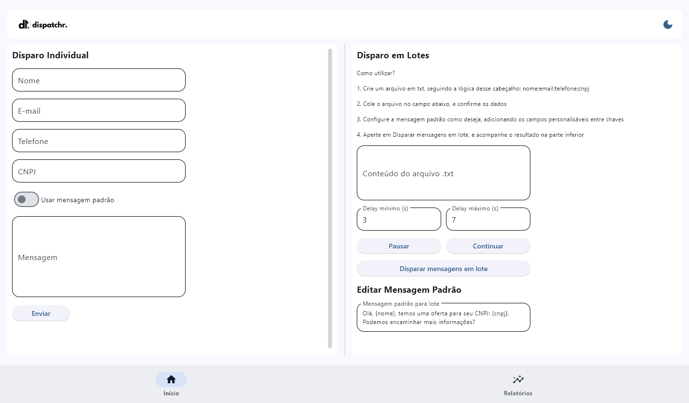
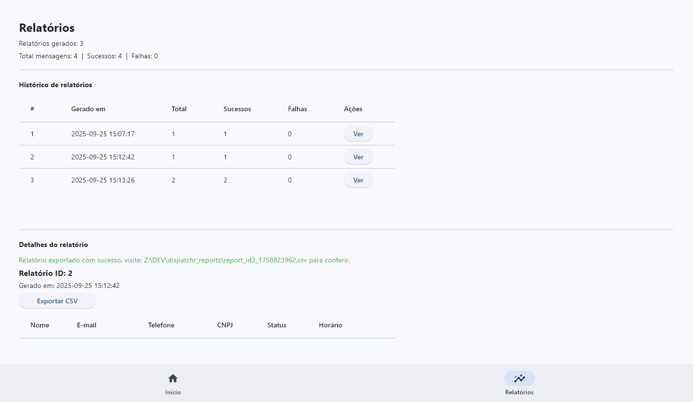

# dispatchr - Disparo de Mensagens via API Chatwoot 🚀
Aplicativo para disparo individual e em lote de mensagens, onde através do Chatwoot, é possível gerar um fluxo completo de acionamento e direcionamento de leads.

## Visão geral ✨
O dispatchr permite:
- Enviar mensagens individuais via formulário.
- Enviar mensagens em lote a partir de um arquivo .txt com cabeçalho separado por `;`.
- Personalizar templates de mensagens com campos entre chaves (ex.: `{nome}`, `{cnpj}`).
- Pausar e retomar execuções de lote.
- Configurar intervalo de delays aleatórios entre os envios (para evitar banimento).
- Gerar, vizualizar e salvar relatórios de execuções.

---

## Recursos principais 🔧
1. UI moderna utilizando o Flet.  
2. Disparo Individual:
   - Campos: **Nome**, **E-mail**, **Telefone**, **CNPJ**, **Mensagem**.
   - Switch para **Usar mensagem padrão** que preenche e trava o campo de mensagem.
   - Botão **Enviar** com feedback de sucesso/erro e geração de relatório único.
3. Disparo em Lotes:
   - Campo para colar conteúdo do `.txt` (primeira linha = cabeçalho; separador `;`).
   - Template de mensagem com placeholders.
   - Configuração de **Delay mínimo** e **Delay máximo** (segundos).
   - Botões **Pausar**, **Continuar**, **Disparar mensagens em lote**.
   - Tratamento de linhas vazias e linhas com número incorreto de campos.
4. Execução robusta:
   - Worker em thread separada para não travar a UI.
   - Flags para evitar execuções concorrentes.
   - Pausa reativa durante esperas subdivididas.
   - Logs recentes limitados e relatórios por execução persistidos.
5. Persistência local via `page.client_storage` (chave: `dispatchr_reports`).  
6. Páginas modulares: `pages.nav` para navegação e `pages.reports` para relatórios.  
7. Assets: suporte a imagem de header (`assets/dispatchr_header.png`).

---

## Requisitos e dependências 🧩
1. Python 3.8+  
2. Flet (`flet`)  
3. requests ou outra lib HTTP (se necessário para Chatwoot)  
4. Implementação de `dispatch_message(name, email, phone, cnpj, content) -> str` em `chatwoot_config/chatwoot_client.py`  
5. Ambiente virtual recomendado (venv, pipenv, poetry)

---

## Instalação passo a passo 🛠️
1. Preparar ambiente:
   - Linux / macOS:
     python3 -m venv .venv
     source .venv/bin/activate
   - Windows (PowerShell):
     python -m venv .venv
     .\.venv\Scripts\Activate.ps1
2. Instalar dependências:
   pip install -r requirements.txt
3. Estrutura mínima:
   - app.py
   - chatwoot_config/chatwoot_client.py
   - pages/nav.py
   - pages/reports.py
   - assets/dispatchr_header.png
4. Configurar `chatwoot_client` com token e base URL (variáveis de ambiente sugeridas).
   - Todas as informações como caixas de entrada, URLs, e IDs devem ser capturadas de acordo com a sua conta no Chatwoot.
5. Rodar:
   python app.py
   - O Flet abre janela desktop ou servidor web conforme ambiente.

---

## Formato do arquivo de lote `.txt` 📄
1. Primeira linha: cabeçalho com colunas separadas por `;` (ex.: `nome;email;telefone;cnpj`).  
2. Linhas seguintes: registros com os mesmos campos na ordem do cabeçalho.  
3. Exemplo:
   nome;email;telefone;cnpj
   Empresa A;contato@empresa.com;11999990000;12.345.678/0001-90
4. Uso no template: `Olá, {nome}, temos uma oferta para seu CNPJ: {cnpj}.`

---

## Comportamento e limites ⚙️
1. Logs recentes limitados a **200** entradas.  
2. Relatórios limitados a **500** execuções mantidas em memória e persistidos.  
3. Delays entre envios são sorteados entre mínimo e máximo configurados.  
4. Erros de envio incrementam contador de falhas e geram entradas de log.  
5. UI safe-update captura falhas ao atualizar a partir de threads para não interromper worker.

---

## Segurança e privacidade 🔒
1. Não comitar tokens/API keys.  
2. Tratar dados pessoais conforme LGPD.  
3. Implementar autenticação se for expor a aplicação em rede pública.

---

## Interface 🖼️
1. Início:
   - 
2. Relatórios:
   - 

